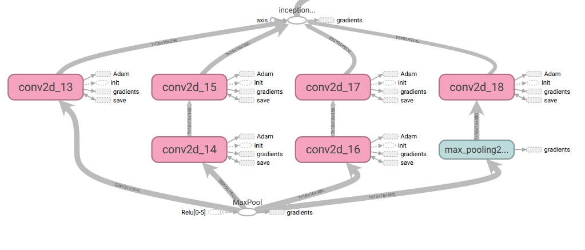
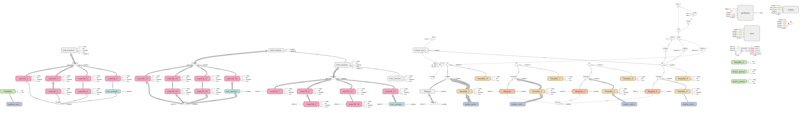
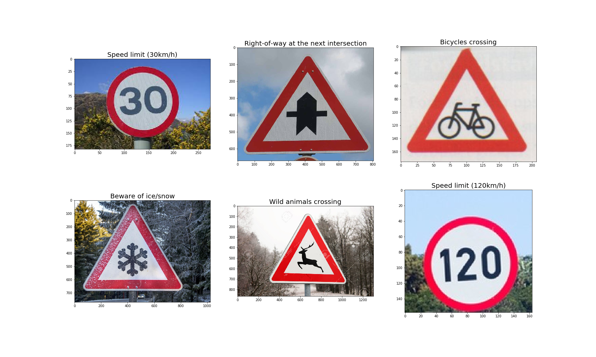
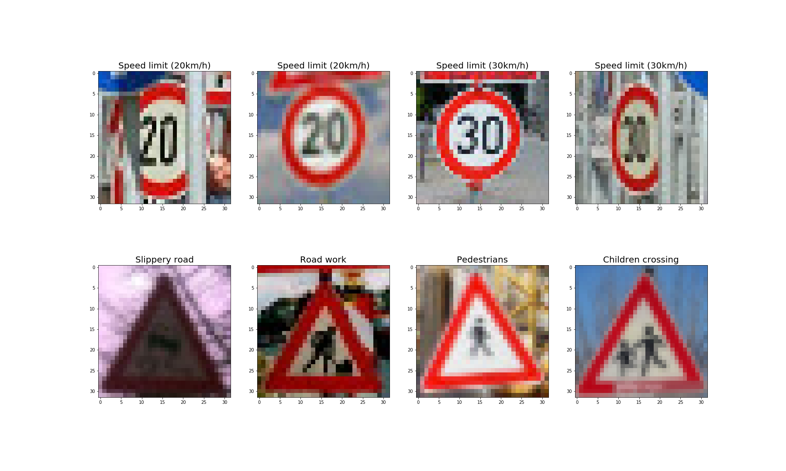
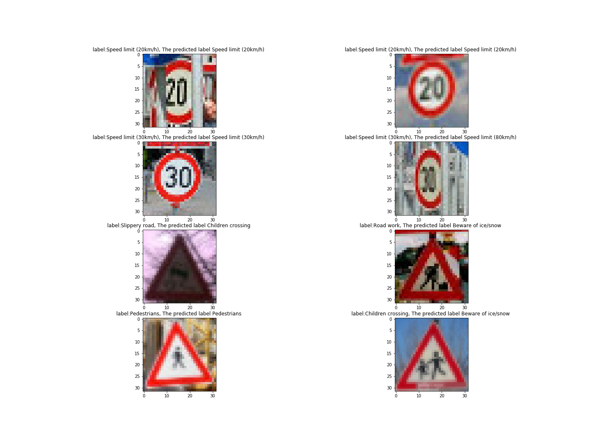

# **Traffic Sign Recognition** 
In this project, I will use deep neural networks and convolutional neural networks to classify traffic signs. I will train and validate a model so it can classify traffic sign images using the [German Traffic Sign Dataset](http://benchmark.ini.rub.de/?section=gtsrb&subsection=dataset). After the model is trained, I will then try out your model on images of German traffic signs that you find on the web.


---

**Build a Traffic Sign Recognition Project**

The steps of this project are the following:
* 1.  Load the data set 
* 2.  Explore, summarize and visualize the data set
* 3.  Pre-processing of the dataset 
* 4.  Design, train and test a model architecture
* 5.  Use the model to make predictions on new images
* 6.  Analyze the softmax probabilities of the new images
* 7.  Visualize the Neural Network's State with Test Images
[//]: # (Image References)

[image1]: ./examples/1.png "Visualization of the dataset"
[image2]:  ./examples/2.png "The characteristics of the images"
[image3]: ./examples/3.png "Distribuation"
[image4]: ./examples/4.png "Imporving the contrast of all images "
[image5]: ./examples/5.png "Data Augmnetation "


[image5]: ./examples/S5.png "Traffic Sign 1"
[image6]: ./examples/S6.png "Traffic Sign 2"
[image7]: ./examples/S7.png "Traffic Sign 3"
[image8]: ./examples/S8.png "Traffic Sign 4"
[image9]: ./examples/S9.png "Traffic Sign 5"
[image10]: ./examples/S10.png "Traffic Sign 6"

[image11]: ./examples/T-00_2.jpg "Traffic Sign 7"
[image12]: ./examples/T_00_1.jpg "Traffic Sign 8"
[image13]: ./examples/T_01_1.jpg "Traffic Sign 9"
[image14]: ./examples/T_01_3.jpg "Traffic Sign 10"
[image15]: ./examples/T_23_1.jpg "Traffic Sign 11"
[image16]: ./examples/T_25_5.jpg "Traffic Sign 12"
[image17]: ./examples/T_27_1.jpg "Traffic Sign 13"
[image18]: ./examples/T_28_0.jpg "Traffic Sign 14"

[image19]: ./examples/19.png "The top five softmax probabilities for the clear images"
[image20]: ./examples/20.png "The top five softmax probabilities for the noisy images"

[image21]: ./examples/21.png  "Feature maps"


## Rubric Points

### Here I will describe how I addressed each step in my implementation.  


#### 1. Load the data set: Since the dataset is a pickled data that has a dictionary with 4 key pairs, I will use the Pickle Library to load data:

  
* 'features' is a 4D array containing raw pixel data of the traffic sign images, (num examples, width, height, channels).
* 'labels' is a 1D array containing the label/class id of the traffic sign. The file signnames.csv contains id -> name mappings for each id.
* 'sizes' is a list containing tuples, (width, height) representing the original width and height the image.
* 'coords' is a list containing tuples, (x1, y1, x2, y2) representing coordinates of a bounding box around the sign in the image.(Notice: THESE COORDINATES ASSUME THE ORIGINAL IMAGE. THE PICKLED DATA CONTAINS RESIZED VERSIONS (32 by 32) OF THESE IMAGES)


```python
# Load pickled data
import pickle

#  Fill this in based on where you saved the training, validation and testing data
training_file = '../data/train.p'
validation_file='../data/valid.p'
testing_file = '../data/test.p'

with open(training_file,mode='rb') as f:
    train=pickle.load(f)
with open(validation_file,mode='rb') as f:
    valid=pickle.load(f)
with open(testing_file,mode='rb') as f:
    test=pickle.load(f)
x_train,y_train=train['features'],train['labels']
x_valid,y_valid=valid['features'],valid['labels']
x_test,y_test=test['features'],test['labels']
```


#### 2. Explore, summarize and visualize the data set: Below is provided a basic summary of the dataset.

After loading the dataset, I asserted weathers the numbers of the training images and labels are equal or not.

    assert(len(x_train)==len(y_train))
    assert(len(x_valid)==len(y_valid))
    assert(len(x_test)==len(y_test))


Then I got the following summary information:

    Number of training examples : 34799
    Number of testing examples : 12630
    Number of validation examples : 4410
    Image shape is: (32 32, 3)
    Number of the label class : 43
    
After the summary section, the file segmentation.csv, which has the corresponding sign name for each class number, was read and printed via the Panadas library.

  |ClassId | 	SignName |
  |---------|-------------|
  |0 |	Speed limit (20km/h)|
  |1 |	Speed limit (30km/h)|
  |2 |	Speed limit (50km/h)|
  |3 |	Speed limit (60km/h)|
  |4 |	Speed limit (70km/h)|
  |5 | 	Speed limit (80km/h)|
  |6 |	End of speed limit (80km/h)|
  |7 | 	Speed limit (100km/h)|


Below is shown some images from the dataset with the coressponding titles:
![alt text][image1]

I was encouraged to to print several images for one label and try to pay attention how the images look like. This is important because I need to know the characteristics of the images that use for training the model
![alt text][image2]

* As seen,the contrast of  images is bad which must be imporved.


#### 3. Pre-processing of the dataset:


First, I will examine the distribution of the labels and look at the comparative distribution of the class instances in the training, validation, and test data set.

![alt text][image3]


    
Then I used the pandas library to find the number of  maximum and minimum traffic sign class in the training , validation and test dataset:

|  Datset  |                             The maximum sign         |        Number      |           the minimum sign  |     Number|
|--- |------------------------------------------------------|---------------------|----------------------------|-----------|
|  training |   End of no passing by vehicles over 3.5 metric |	2010      |        Speed limit (20km/h)   |	180|
| validation | End of no passing by vehicles over 3.5 metric | 	240       |        Speed limit (20km/h)   |	30 |
| test |   End of no passing by vehicles over 3.5 metric | 	750        |       Speed limit (20km/h)   |	60  |


There are three common forms of data preprocessing:

1. Mean subtraction is the most common form of preprocessing. It involves subtracting the mean across every individual feature in the data, and has the geometric interpretation of centering(the cloud of data around the origin along every dimension).

2. Normalization refers to normalizing the data dimensions so that they are of approximately the same scale(for example in range from 0 to 1).

3. PCA and Whitening is another form of preprocessing. In this process, the data is first centered as described above. Then, we can compute the covariance matrix that tells us about the correlation structure in the data.

Befor normalizing all images I converted all images to the LAB color system(L for lightness and a and b for the color opponents green–red and blue–yellow) to improve the contrast of images by using CLAHE (Contrast Limited Adaptive Histogram Equalization) from the opencv library (to only Lightness component and convert back the image to RGB). 

![alt text][image4]

then I normalized all the images so that they have a mean zero and equal variance (in range from 0 to 4).

   
    the maximum value for each image in the dataset  3.832561342409173
    the minimum value for each image in the dataset  0

From the presented distribution above, we can see that both training and validation set have similar distribution of traffic sign samples but problem is that there is a huge variability of the distribution between class instances within the dataset,maybe we can develop augmentation techniques to equalize them. I decided to develop the augmentation methods like salt papper noise, rotation and translation methods with help of openc cv library and using Tensorflow the random_brightness and flip_left_right methods for data augmentation.


![alt text][image5]


### 4. Design, train and test a model architecture: In this section i am going to describe what the final model architecture looks like including model type, layers, layer sizes, connectivity.

#### Design a model architecture:

The way I did to find the final model architecture was related to the accuracy of the model, as known, one of the best archituctues in the fied of deep learing that has achieved much attention is the inception module, for this reason I used the inception modules to increase the accuracy of my model.


<p align="center">

<p align="center">  
  The inception module
<p align="center">
<p align="center">
 
I chosed Adam opzimizer Adam (Adaptive Moment Estimation) as the loss function, which divide the learning rate for a weight by a running average of the magnitudes of recent gradients for that weight. This helps in faster gradient descent and it is more accurate than SGD and GD.

For visualizing the model architecture, I tried to open the tensorboard environment (tensorboard --logdir=" the adress of the save path  " --port 6006) and I got the below presented graph.


<p align="center">

<p align="center">  
The model architecture
<p align="center">
<p align="center">
  
   |Layer| 	Description |	Input| 	Output|
   |-----|--------------|------|-------|
   |Inception with batch_normalization and relu  activation |	Inception3a |	(?,32,32,3) |	(?, 32, 32, 256)|
   | Inception with batch_normalization and relu  activation |	Inception3b |	(?,32,32,256) |	(?, 32, 32, 480)|
   | Max pooling |	 kernel: 2x2; stride:2x2; padding: Same;  | (?, 32, 32, 480)| 	(?, 16, 16, 480)|
   | Inception with batch_normalization and relu  activation 	|Inception3c |	(?, 16, 16, 480) |	(?, 16, 16, 766)|
   | Max pooling 	| kernel: 2x2; stride:2x2; padding: Same; |  (?, 16, 16, 766) |	(?, 8, 8, 766)|
   | Flatten 	|Squeeze the cube into one dimension |(?,8,8,766) |(?,49024)|
   | Fully connected with dropout |	scope:fully_1; pairwise connections between all nodes |	(?,49024) 	|(?,1024)|
   | Fully connected with dropout	scope:fully_2;| pairwise connections between all nodes |	(?,1024)| 	(?,512)|
   | Fully connected with dropout	scope:fully_3; |pairwise connections between all nodes 	|(?,512) |	(?,128)|
   |Fully connected with dropout |	scope=out; pairwise connections between all nodes  |	(?,128)  |	(?,43) |


To measure the loss and accuracy of the validation set during the training phase, the evaluate(X_data, y_data) function was implemented.
```python

def evaluate(X_data, y_data):
    num_examples = len(y_data)
    total_accuracy = 0
    total_loss=0
    sess = tf.get_default_session()
    for offset in range(0, num_examples, Batch_size):
     
        x_batch,y_batch=x_train[offset:offset+Batch_size],y_train[offset:offset+Batch_size]
  
        val_acc,loss = sess.run([accuracy,loss_operation], feed_dict={x: x_batch, y: y_batch, keep_prob:1.0})
        total_accuracy += (val_acc * len(x_batch))
        total_loss+=(loss* len(x_batch))

    #print('loss: ',total_loss/num_examples)

    return (total_accuracy / num_examples,total_loss/num_examples)

```
#### Train the model architecture:

To train the model,the training data passed through a training pipeline which shuffles the training set before each epoch and after each epoch measures the loss and accuracy of the validation set and saves the model after training.


I chose these hyperparameters based my experiences that I had with the taining phase. I tried to train my model for more epochs to see if I get a better result but I relized that a batch size of 256 can lead to a faster convergence.


Hyperparameter tuning

    LEARNING RATE = 0.0003
    EPOCHS = 10
    BATCH SIZE = 256
    Dropout keep probability rate : 0.5


      
To describe how the approach taken for finding a solution and getting the validation set accuracy to be at least 0.93, I am going to include below the steps I took to get to the final solution:
     
 1. Trying data augmentation which didn't help me .
 2. Initializing all variables with xavier_initializer() function which has the better advantage in the field of convergence. 
 3. Adding dropout regularization at the end of each fully connected layer and achieved improvements. 
 4. Batch normalization is used after the each Inception modulel layer.
 
The final model was constructed and it took me about quarter  hour  to train on 10 iterations, after that I measured the loss and accuracy of the Training Validation and Test dataset and I got (with learning_rate=0.0003):

      Train Accuracy 0.9965516250466967
      Validation Accuracy 0.9417233560361019
      Test Accuracy 0.9375296910603841
    
### 5.  Use the model to make predictions on new images

To give myself more insight into how your model is working,I downloaded 14 pictures of traffic signs from the web (6 pictures without Noise and 8 noisy pictures) and use your model to predict the traffic sign type. you may find signnames.csv useful as it contains mappings from the class id (integer) to the actual sign name.

Here are the pictures without Noise that I found on the web:
<p align="center">

<p align="center">  
Here I am going to predict the Sign Type for the clear Images:
<p align="center">

<p align="center"> 
  
---
  
Below are presented the noisy Images and the corresponding prediction:

Load and Output the noisy Images:
<p align="center">

<p align="center">  

The corresponding prediction for the noisy Images:
<p align="center">

<p align="center">  

  
### 6. Analyze the softmax probabilities of the new images: 
In this section to discuss the model's predictions on these new traffic signs, for each of the new images(clear images and noisy images), print out the model's softmax probabilities to show the certainty of the model's predictions (limit the output to the top 5 probabilities for each image). tf.nn.top_k could prove helpful here.

The below th result indices  demonstrate how tf.nn.top_k can be used to find the top k predictions for each image.

**The top five softmax probabilities of the clear image's predictions are outputted.**


      ------------------------------------------------------------
    The label of the image 0  is 1 which has the corresponding predictions of  [[1 0 2 3 4]] 
    ------------------------------------------------------------
    The label of the image 1  is 30 which has the corresponding predictions of  [[11  0  1  2  3]] 
    ------------------------------------------------------------
    The label of the image 2  is 8 which has the corresponding predictions of  [[29  0  1  2  3]] 
    ------------------------------------------------------------
    The label of the image 3  is 31 which has the corresponding predictions of  [[24 28 30 20  0]] 
    ------------------------------------------------------------
    The label of the image 4  is 29 which has the corresponding predictions of  [[29  0  1  2  3]] 
    ------------------------------------------------------------
    The label of the image 5  is 11 which has the corresponding predictions of  [[9 0 1 2 3]] 

    
**The top five softmax probabilities of the noisy image's predictions are outputted.**
    
    ------------------------------------------------------------
    The label of the image 0  is 0 which has the corresponding predictions of  [[0 1 4 2 3]] 
    ------------------------------------------------------------
    The label of the image 1  is 0 which has the corresponding predictions of  [[0 1 2 3 4]] 
    ------------------------------------------------------------
    The label of the image 2  is 1 which has the corresponding predictions of  [[1 0 2 3 4]] 
    ------------------------------------------------------------
    The label of the image 3  is 1 which has the corresponding predictions of  [[ 5  2  7 15  0]] 
    ------------------------------------------------------------
    The label of the image 4  is 23 which has the corresponding predictions of  [[28 29 24 20 30]] 
    ------------------------------------------------------------
    The label of the image 5  is 25 which has the corresponding predictions of  [[30 28  0  1  2]] 
    ------------------------------------------------------------
    The label of the image 6  is 27 which has the corresponding predictions of  [[27  0  1  2  3]] 
    ------------------------------------------------------------
    The label of the image 7  is 28 which has the corresponding predictions of  [[30  0  1  2  3]] 


#### 3. Describe how certain the model is when predicting on each of the five new images by looking at the softmax probabilities for each prediction. Provide the top 5 softmax probabilities for each image along with the sign type of each probability. (OPTIONAL: as described in the "Stand Out Suggestions" part of the rubric, visualizations can also be provided such as bar charts)

Predict the Sign Type for the clear Images!
[alt text][image19]


Predict the Sign Type for the noisy Images!
[alt text][image20]


### (Optional) Visualizing the Neural Network (See Step 4 of the Ipython notebook for more details)
Provided the function code that allows us to get the visualization output of any Tensorflow weight layer we want. The inputs to the function should be a stimuli image, one used during training or a new one you provided, and then the Tensorflow variable name that represents the layer's state during the training process.The result of the first cinvolutional layer is presented below.
![alt text][image21]


#### 1. Discuss the visual output of your trained network's feature maps. What characteristics did the neural network use to make classifications?


